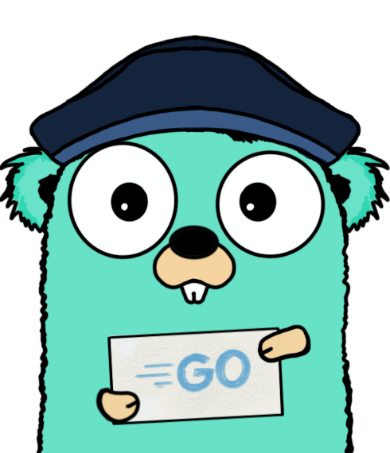

# Gogrok: Go Codebase Analytics & Interdependency Explorer

[](https://pkg.go.dev/github.com/perbu/gogrok)
Gogrok analyzes a collection of local Go modules to provide insights into their structure, dependencies, and relationships. It helps answer questions like "Which local modules use this package?" or "What are the dependencies of this module?".

 ## Features

* **Dependency Mapping:** Parses `go.mod` files to identify direct module dependencies.
* **Reverse Dependency Tracking:** Determines which local modules and packages depend on a given module or package.
* **Source Code Analysis:** Parses Go source files (`.go`) to understand package imports and structure.
* **Basic Code Metrics:** Calculates Lines of Code (LoC) and Cyclomatic Complexity for files, packages, and modules. Differentiates generated code.
* **Version Tracking:** Identifies the latest Git tag for local modules and fetches available versions for external dependencies from `proxy.golang.org` (with caching).
* **Web Interface:** Provides an interactive web UI (using Go Templates/`templ` and HTMX) to browse:
    * Local Modules
    * External Dependencies
    * Module details (dependencies, reverse dependencies, packages, versions)
    * Package details (files, reverse dependencies, stats)
    * File contents

## How It Works

Gogrok requires the Go modules you want to analyze to be present as subdirectories within a `code/` directory relative to where you run Gogrok. These should ideally be Git checkouts.

1.  **Initialization:** Reads the directories within `code/`.
2.  **Module Parsing:** Parses the `go.mod` file in each directory to identify the module path and its required dependencies. It builds an initial map of local and external modules. It also fetches the latest Git tag for local modules.
3.  **Source Parsing:** For local modules, it walks the directory tree, parsing all `.go` files using Go's `go/parser` and `go/ast` packages. It identifies package imports and links them back to the corresponding modules (local or external).
4.  **Reverse Dependency Calculation:** Populates reverse dependencies for both modules and packages based on the parsed import graph.
5.  **External Version Fetching:** Queries `proxy.golang.org` to get a list of available versions for all identified external modules. Results are cached in `.cache.bolt.db`.
6.  **Web Server:** Starts a web server presenting the analyzed data through an HTMX-powered interface.

## Getting Started

1.  **Clone the repository:**
    ```bash
    git clone [https://github.com/perbu/gogrok.git](https://github.com/perbu/gogrok.git)
    cd gogrok
    ```
2.  **Create the code directory:**
    ```bash
    mkdir code
    ```
3.  **Clone your Go modules into the `code/` directory:**
    ```bash
    cd code
    git clone git@github.com:your-org/your-module1.git
    git clone git@github.com:your-org/your-module2.git
    # ... add all modules you want to analyze
    cd ..
    ```
4.  **Build and Run:**
    ```bash
    go build .
    ./gogrok
    # Or run directly
    # go run main.go
    ```
5.  Open your web browser to `http://localhost:8080` (or the port specified by the `PORT` environment variable).

### Updating Repositories

To update all the Git repositories in the `code/` directory, you can use a helper script or commands like these:

**Using GNU Parallel (Faster):**

* Create a file `repos.txt` inside the `code/` directory listing the subdirectory names (one per line).
* Run:
    ```bash
    cd code
    cat repos.txt | parallel -j 5 'echo {}; git -C {} pull'
    cd ..
    ```

**Simple Loop:**

* Create `repos.txt` as above.
* Run:
    ```bash
    cd code
    for repo in $(cat repos.txt); do echo "Updating $repo"; git -C "$repo" pull; done
    cd ..
    ```
  *(Consider adding SSH ControlMaster settings to your `~/.ssh/config` for speed, as mentioned in the original README).*

## Planned Features / Future Work

* Security vulnerability scanning integration.
 * Integrate govulncheck, either via exec or look at https://github.com/golangci/golangci-lint/blob/main/cmd/golangci-lint/main.go
 * 
* More advanced code metrics (e.g., maintainability index, coupling).
 * Maintainability Index: Calculate this based on complexity, LoC, etc.
 * Coupling & Cohesion: Analyze afferent (incoming) and efferent (outgoing) couplings for packages/modules. High efferent coupling might indicate a module relies too heavily on others. High afferent coupling means many others depend on it (potential bottleneck or core library).
 * Code Duplication: Integrate a tool (like gocpd or build a simpler AST-based checker) to find duplicated code blocks across modules.
 * Dead Code Detection: Identify exported functions/types within your local modules that are not used by any other local modules.
* Dependency analysis:
  * Transitive Dependencies: Show the full chain of dependencies, not just direct ones.
  * Dependency Updates: Flag modules (local and external) where the version used is significantly behind the latest available version ( fetched via proxy.golang.org or git tags). Differentiate between minor/patch updates and major version changes.
  * License Compliance: Parse LICENSE files (if possible) or integrate with APIs that provide license info for external dependencies. Allow defining allowed/disallowed licenses.
* Improved UI/UX.
  * Dependency Graphs: Generate visual graphs (e.g., using Mermaid.js, Cytoscape.js, or Graphviz) showing module-to-module or package-to-package dependencies and reverse dependencies. Make them interactive (zoom, pan, click nodes to navigate).
* Optional persistent caching of analysis results if startup-times becomes a problem.
* Try it out on k8s and docker. 

## License

[BSD 3-Clause License](LICENSE.md) - Copyright (c) 2024 Per Buer.